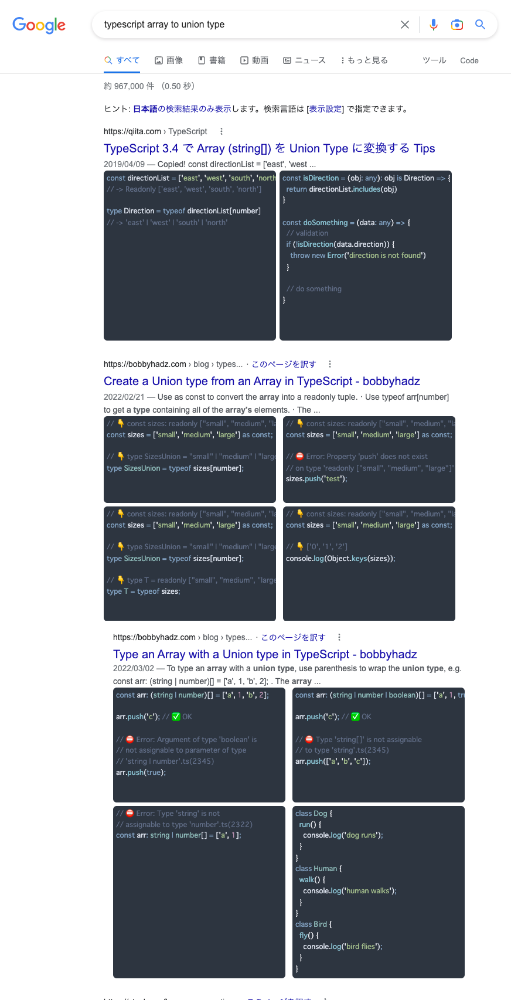

# Google Search Code Viewer

It is a Chrome extension that displays the code within each page in Google search results.

You can change the theme and layout in the settings.

## Install

<https://chrome.google.com/webstore/detail/fgbckiappabdbccgpkckpaanlbddbggm>

## Screenshot

